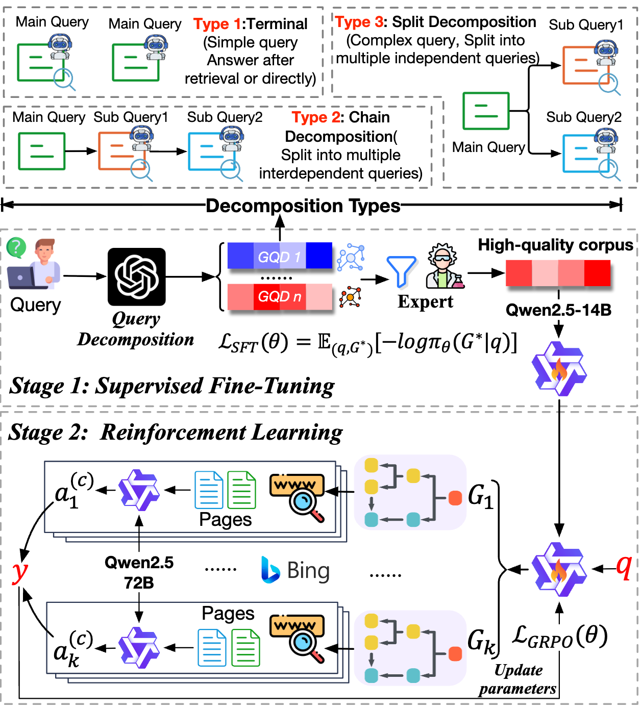

# GraTAG: Production AI Search via Graph-Based Query Decomposition and Triplet-Aligned Generation with Rich Multimodal Representations

<p align="center">
  <a href="https://creativecommons.org/licenses/by-nc/4.0/"></a>
  
</p>

<p align="center">
  
</p>

**GraTAG** is a comprehensive AI search engine framework that addresses key challenges in relevance, comprehensiveness, and presentation through three core innovations:

* **Graph-Based Query Decomposition (GQD)** — dynamically breaks down complex or ambiguous queries into structured sub-queries with explicit dependencies, enabling more precise, stepwise retrieval.

<!-- <p align="center">
  
</p> -->

* **Triplet-Aligned Generation (TAG)** — dynamically constructs relation triplets from retrieved documents to explicitly model entity relationships, factual dependencies, and logical connections, enabling the model to generate more coherent and comprehensive answers.

<!-- <p align="center">
  
</p> -->

* **Rich Multimodal Presentations** — integrates timeline visualization and textual-visual choreography to reduce cognitive load and enhance information verification.

<!-- <p align="center">
  
</p> -->

Evaluated on 1,000 recent real-world queries with over 243,000 expert ratings across 9 criteria, GraTAG **outperforms eight existing systems** in human expert assessments, excelling in relevance, comprehensiveness, and insightfulness. Compared to the strongest baseline, GraTAG improves comprehensiveness by **10.8%**, insightfulness by **7.9%**, and the overall average score by **4.8%**. On the public benchmark BrowseComp, GraTAG outperforms the best baseline by **17.3%**.

<p align="center">
  
</p>

---

## Pipeline Overview

GraTAG is an end-to-end production-ready RAG system comprising seven key stages:

1. **Query Preprocessing** — uses a fine-tuned LLM to filter unsafe content, clarify ambiguous queries, and canonicalize spatiotemporal expressions.
2. **Graph-Based Query Decomposition (GQD)** — decomposes complex queries into structured sub-queries with explicit dependencies to enable hierarchical reasoning.
3. **Sub-query Expansion** — generates semantic variations to improve coverage.
4. **Stepwise Retrieval** — performs multi-source retrieval guided by the GQD structure.
5. **Deduplication and Reranking** — removes redundancy and suppresses noise from retrieved documents.
6. **Triplet-Aligned Generation (TAG)** — dynamically constructs relation triplets from evidence chunks to restore logical coherence.
7. **Rich Multimodal Presentations** — delivers structured outputs with timelines and citations to enhance user experience.

---

## Concepts at a Glance

* **GQD** decomposes complex queries into atomic sub-queries represented as a directed acyclic graph (DAG) that explicitly encodes information flow among sub-queries. In contrast to linear or tree-based approaches, GQD captures parallel and joint dependencies, enabling finer-grained and more flexible reasoning. The GQD model is post-trained via supervised fine-tuning on curated query-GQD pairs, followed by reinforcement learning (GRPO) alignment with RAG task performance.
* **TAG** extracts triplets from retrieved documents and aligns them with the answer generation process to explicitly bridge missing logic and relations across chunks. By injecting these structural cues, TAG enhances cross-chunk reasoning coherence and mitigates hallucination. TAG employs a cold-start triplet extraction stage followed by answer generation training with REINFORCE-based triplet alignment.
* **Rich Multimodal Presentation** integrates timeline visualizations and textual-visual choreography to reduce cognitive load and enhance information verification. Timeline visualization extracts, deduplicates, groups, and sorts events from retrieved chunks; textual-visual choreography matches and places relevant images alongside generated paragraphs using a multi-measure similarity scoring and the Hungarian algorithm.

---

## Repository Layout

```
.
├── alg/
│   ├── src/
│   │   ├── include/
│   │   ├── model_training/
│   │   │   ├── GQD/                 # GQD training (SFT + GRPO)
│   │   │   └── TAG/                 # TAG training (triplet extraction + alignment)
│   │   ├── modules/
│   │   ├── pipeline/
│   │   └── script/
│   ├── Dockerfile
│   ├── requirements.txt
│   ├── route.json
│   ├── run.py
│   └── README.md
├── backend/                         # Backend API service
├── exp/
│   ├── query/                       # Evaluation query sets
│   │   ├── SearchBench_1000_en.txt  # SearchBench-1000 (English)
│   │   ├── SearchBench_1000_en_cn.txt  # SearchBench-1000 (English + Chinese)
│   │   └── browse_comp_test_set_decrypted.csv  # BrowseComp test set
│   └── answer_web_crawler/          # Baseline answer collection via browser automation
│       ├── crawlers/                # Per-product crawlers (Perplexity, Kimi, Ernie, etc.)
│       ├── evaluate.py              # GPT-based answer extraction and judging
│       ├── run_all.py               # Orchestration: crawl / evaluate / summary
│       └── run_crawler.py           # Single-product crawler entry
├── frontend/                        # Frontend web UI
├── LICENSE                          # CC BY-NC 4.0 license
└── README.md                        # (this file)
```

> `alg/` contains the core algorithm service and model training code. `backend/` provides the RESTful API layer. `frontend/` stores the web UI. `exp/` holds evaluation benchmarks and baseline collection scripts used in the paper experiments.

---

## Code Documentation

### Architecture Overview

GraTAG adopts a three-tier architecture:

| Layer | Directory | Tech Stack | Description |
|-------|-----------|------------|-------------|
| **Frontend** | `frontend/` | Nuxt 3 + TypeScript + SCSS | Search interface with streaming answer display, timeline visualization, and document preview |
| **Backend** | `backend/` | Flask + MongoEngine + JWT | RESTful API layer handling user management, QA session persistence, and algorithm service orchestration |
| **Algorithm** | `alg/` | Flask + NetworkX + Transformers | Core AI pipeline implementing GQD, TAG, multi-source retrieval, and multimodal presentation |

The services communicate via HTTP: Frontend → Backend API → Algorithm Service. The algorithm service exposes two endpoints (`/execute` and `/stream_execute`) for synchronous and streaming invocations respectively.

### Infrastructure Dependencies

| Service | Purpose | Version |
|---------|---------|---------|
| **MongoDB** | Application data storage (QA sessions, users, subscriptions) | 4.x+ |
| **Elasticsearch** | Context persistence, search indexing, and full-text retrieval | 7.10+ |
| **Milvus** | Vector similarity search for dense retrieval | 2.4+ |
| **LLM Inference** | Language model serving (vLLM / HuggingFace TGI compatible) | — |
| **Nacos** | Service discovery and registration (optional) | 1.x |
| **OSS / MinIO** | Object storage for documents and images | — |

---

### Deployment Guide

#### Prerequisites: Infrastructure Services

Before deploying GraTAG, ensure the following infrastructure services are running and accessible:

| Service | Required | Default Port | Setup |
|---------|----------|-------------|-------|
| MongoDB | Yes | 27017 | Stores user data, QA sessions, subscriptions. Create a database (e.g. `gratag`) with authentication. |
| Elasticsearch | Yes | 9200 | Stores QA context for multi-turn conversations and provides full-text retrieval. Version 7.10+ recommended. |
| Milvus | Optional | 19530 | Provides dense vector retrieval. Required for vector similarity search in the recall stage. Version 2.4+ recommended. |
| LLM Inference | Yes | — | vLLM or HuggingFace TGI compatible endpoint serving models such as Qwen2.5-72B-Instruct. |
| OSS / MinIO | Optional | 9000 (MinIO) | Object storage for uploaded documents and images. Required for document QA mode. |
| Nacos | Optional | 8848 | Service discovery and centralized configuration management. Can be replaced by local config files. |

---

#### Step 1: Deploy Algorithm Service

**1.1 Environment Setup**

```bash
cd alg/src

conda create -n gratag python=3.9 -y
conda activate gratag

pip install -r requirements.txt

# Chinese NLP model (required for spaCy tokenization)
pip install zh_core_web_sm-3.8.0.tar.gz
```

**1.2 Configuration**

Edit `include/config/common_config.py` with your infrastructure endpoints:

```python
CommonConfig = {
    # LLM inference endpoints
    "FSCHAT": {
        "vllm_url": "http://<llm-host>:8000/v1",
        "hf_url":   "http://<llm-host>:8001"
    },

    # Elasticsearch (QA context storage)
    "ES_QA": {
        "url":   "http://<es-host>:9200",
        "index": "gratag_qa_context",
        "auth":  "<username>",
        "passwd": "<password>"
    },

    # MongoDB
    "MONGODB": {
        "Host": "<mongodb-host>",
        "Port": 27017,
        "DB":   "gratag",
        "Username": "<username>",
        "Password": "<password>",
        "authDB":   "admin"
    },

    # Milvus (vector search, optional)
    "MILVUS": {
        "host": "<milvus-host>",
        "port": 19530,
        "collection": "gratag_vectors"
    },

    # Reranking thresholds
    "RERANK": {
        "topk_es":     1000,
        "topk_vec":    500,
        "topk_rerank": 150
    },

    # External search API
    "IAAR_DataBase": {
        "url": "http://<search-api-host>/search"
    }
}
```

Also configure `include/config/query_recommend_config.py` for query recommendation settings.

**1.3 Launch**

```bash
# Development
python run.py --host 0.0.0.0 --port 10051

# Production (with gunicorn)
gunicorn -w 4 -b 0.0.0.0:10051 --timeout 300 run:app
```

**1.4 Docker Deployment**

```bash
cd alg/src
docker build -t gratag-alg .
docker run -d \
  --name gratag-alg \
  -p 10051:10051 \
  gratag-alg
```

The algorithm Dockerfile (`alg/src/Dockerfile`) is based on the `iaar/ainews:v4.1` image with Python 3.9, and automatically installs dependencies and the Chinese spaCy model. The exposed port range is `10000–20000`.

**1.5 Verify**

```bash
curl -X POST http://localhost:10051/execute \
  -H "Content-Type: application/json" \
  -d '{"function": "recommend_query", "body": {"query": "test"}}'
```

---

#### Step 2: Deploy Backend Service

**2.1 Environment Setup**

```bash
cd backend

pip install -r requirements.txt
```

**2.2 Configuration**

The backend supports two configuration modes: **local config file** or **Nacos centralized config**.

**Option A: Local Configuration**

Copy `Backend/config/config.ini` to `Backend/config/config_local.ini` and fill in all fields:

```ini
[DEFAULT]
Host = 0.0.0.0
Port = 5000
LOG_DIR = ./logs
TOKEN_KEY = <your-jwt-secret-key>
ALGORITHM_URL = http://<alg-host>:10051

[MONGO]
Host = <mongodb-host>
Port = 27017
DB = gratag
Username = <username>
Password = <password>
authDB = admin

[ES]
url = http://<es-host>:9200
auth = <username>
passwd = <password>
search_index = gratag_search

[PROMETHEUS]
enable_flask = True
process_name = gratag-backend

[MINIO]
url = http://<minio-host>:9000
access_key = <access-key>
secret_key = <secret-key>

[OSS]
endpoint = <oss-endpoint>
access_key_id = <access-key-id>
access_key_secret = <access-key-secret>
bucket_name = <bucket-name>
img_bucket = 
oss_env = prod
```

Then set Nacos to use local mode in `Backend/config/nacos_config.ini`:

```ini
[NACOS]
REGISTRATION_SWITCH = false
LOCAL_CONFIG = true
```

**Option B: Nacos Centralized Configuration**

Edit `Backend/config/nacos_config.ini`:

```ini
[NACOS]
REGISTRATION_SWITCH = true
LOCAL_CONFIG = false
SERVER_ADDRESSES = <nacos-host>:8848
NAMESPACE = <namespace-id>
AK = <access-key>
SK = <secret-key>
DATA_ID = gratag-backend-config
GROUP = DEFAULT_GROUP
LOG_DIR = ./logs
SERVICE_NAME = gratag-backend
CLUSTER_NAME = DEFAULT
```

Push the configuration JSON to Nacos with the same structure as `config.ini` sections (keys: `default`, `mongo`, `ES`, `PROMETHEUS`, `MINIO`, `OSS`, etc.).

**2.3 Launch**

```bash
cd Backend

# Development
python run.py

# Production (with gunicorn)
gunicorn -w 4 -b 0.0.0.0:5000 --timeout 300 "app:app"
```

When Nacos registration is enabled, the backend automatically registers itself and sends heartbeats every 3 seconds. The environment variable `NACOS_HOST_IP` must be set to the host's accessible IP.

**2.4 Docker Deployment**

**Using python:3.9-slim base image (recommended for fresh builds):**

```bash
cd backend
docker build -f Dockerfile1 -t gratag-backend .
docker run -d \
  --name gratag-backend \
  -p 5000:5000 \
  -e NACOS_HOST_IP=<host-ip> \
  -v $(pwd)/Backend/logs:/app/Backend/logs \
  gratag-backend \
  python run.py
```

This Dockerfile installs Java Runtime, LibreOffice (for document conversion), and additional dependencies including Azure Cognitive Services and MinIO client.

**Using pre-built base image:**

```bash
cd backend
docker build -t gratag-backend .
docker run -d \
  --name gratag-backend \
  -p 5000:5000 \
  -e NACOS_HOST_IP=<host-ip> \
  gratag-backend \
  python run.py
```

**2.5 Verify**

```bash
# Health check
curl http://localhost:5000/api/heartbeat
# Expected: {"status": "1"}
```

**2.6 Key Backend Features**

- **JWT Authentication**: 30-day access token expiry, blacklist-enabled, login status validation with 7-day rolling expiry.
- **CORS**: Fully open (`*`) for cross-origin requests.
- **Prometheus Monitoring**: Enabled via config, exposes `/metrics` endpoint.
- **Request Logging**: All requests/responses logged to `logs/response.log` with user identity, timing, and full payloads.
- **Admin Access Control**: `/admin/*` routes require `access_type != 'normal'`.

---

#### Step 3: Deploy Frontend

**3.1 Environment Setup**

```bash
cd frontend

# Uses pnpm-compatible .npmrc; npm/pnpm both work
npm install
```

**3.2 Environment Configuration**

The frontend uses environment files to configure the backend API endpoint:

**Development** (`.env.dev`):

```
VITE_API=https://<dev-api-gateway>/back/
VITE_ENV=sit
```

**Production** (`.env.prod`):

```
VITE_API=https://<prod-api-gateway>/back/
VITE_ENV=prod
```

**3.3 Launch**

```bash
# Development (with hot-reload)
npm run dev

# Production build
npm run build

# Production server (Nuxt 3 SSR)
npm run start
```

**3.4 Docker Deployment**

The project includes a `.dockerignore` for the frontend. A typical Dockerfile for the Nuxt 3 frontend:

```dockerfile
FROM node:18-alpine
WORKDIR /app
COPY package*.json ./
RUN npm install
COPY . .
RUN npm run build
EXPOSE 3000
CMD ["node", ".output/server/index.mjs"]
```

```bash
cd frontend
docker build -t gratag-frontend .
docker run -d \
  --name gratag-frontend \
  -p 3000:3000 \
  gratag-frontend
```

**3.5 Reverse Proxy (Nginx Example)**

In production, use a reverse proxy to unify frontend and backend under one domain:

```nginx
server {
    listen 80;
    server_name your-domain.com;

    location / {
        proxy_pass http://localhost:3000;
        proxy_http_version 1.1;
        proxy_set_header Upgrade $http_upgrade;
        proxy_set_header Connection "upgrade";
    }

    location /api/ {
        proxy_pass http://localhost:5000/api/;
        proxy_http_version 1.1;
        proxy_set_header X-Real-IP $remote_addr;
        proxy_set_header X-Forwarded-For $proxy_add_x_forwarded_for;

        # SSE streaming support
        proxy_set_header Connection '';
        proxy_buffering off;
        proxy_cache off;
        chunked_transfer_encoding on;
        proxy_read_timeout 300s;
    }
}
```

---

#### Full Stack Deployment Summary

```
┌─────────────┐     ┌─────────────────┐     ┌──────────────────┐
│  Frontend    │────▶│  Backend (Flask) │────▶│  Algorithm (Flask)│
│  Nuxt 3     │     │  Port: 5000      │     │  Port: 10051      │
│  Port: 3000 │     │                  │     │                   │
└─────────────┘     └────────┬─────────┘     └────────┬──────────┘
                             │                         │
                    ┌────────┴─────────┐      ┌───────┴───────────┐
                    │   MongoDB:27017  │      │  Elasticsearch    │
                    │   Nacos:8848     │      │  Milvus           │
                    │   OSS/MinIO      │      │  LLM Inference    │
                    └──────────────────┘      └───────────────────┘
```

**Startup Order:**

1. Infrastructure services (MongoDB, Elasticsearch, Milvus, LLM)
2. Algorithm service (`alg/src/run.py`)
3. Backend service (`backend/Backend/run.py`)
4. Frontend (`frontend/`)

**Environment Variables:**

| Variable | Service | Description |
|----------|---------|-------------|
| `NACOS_HOST_IP` | Backend | Host IP for Nacos service registration |
| `VITE_API` | Frontend | Backend API gateway URL |
| `VITE_ENV` | Frontend | Environment identifier (`sit` / `prod`) |

**Test-Time Latency** (Sec. 4.3.4):

GraTAG maximizes parallelism (e.g., executing lateral sub-queries in GQD concurrently) and employs model fine-tuning and quantization to reduce latency.

| System | Latency (s) |
|--------|-------------|
| GraTAG | 14.2 |
| Perplexity AI | 13.9 |
| Tiangong AI | 4.0 |
| Ernie Bot | 6.0 |
| KIMI | 2.8 |
| Metaso | 10.4 |
| ChatGLM | 7.9 |
| Baichuan | 6.1 |
| Tongyi | 10.4 |

GraTAG latency is measured on a cluster of **16 Muxi MXC500 GPUs** (each ~70% computing power of NVIDIA A800). Baselines are measured via their publicly available interfaces.

---

### Core Module Reference

#### Pipeline Entry — `alg/src/pipeline/functions.py`

The main pipeline orchestrates the full answer generation flow through two primary functions:

| Function | Description |
|----------|-------------|
| `supply_question(body, headers)` | Phase 1: Receives user query, performs intent understanding (rejection check, supplementary question generation, query translation), and initializes the QA context. |
| `answer(body, headers)` | Phase 2: Executes the full RAG pipeline — query decomposition, retrieval, answer generation, and timeline construction — returning a streaming response. |

**Execution Flow of `answer()`:**

```
1. Load QA context from Elasticsearch
2. [Parallel] Query decomposition (GQD) + Retrieval range detection
3. Graph-based multi-source retrieval
4. [Parallel] Answer generation (TAG, streaming) + Timeline generation
5. Further question recommendation
6. Stream results via Server-Sent Events
```

#### Query Preprocessing and Intent Understanding

**Query Preprocessing** (Appendix A.1): A fine-tuned LLM (Qwen-2.5-14B) filters unsafe/harmful queries and clarifies ambiguous ones by prompting the user with options. A second LLM (Qwen-2.5-14B) rewrites the query by resolving relative spatiotemporal terms (e.g., "last week" → precise timestamp ranges), vague locations ("nearby" → specific places), and incomplete entity names.

**Class: `IntentionUnderstandingTask`** — `modules/intention_understanding_group/`

| Method | Output |
|--------|--------|
| `get_intention()` | Returns rejection decision, supplementary question suggestions, related events, and translated query |
| `get_reject_judgement()` | Returns only the rejection decision for unsafe/inappropriate content |

Output structure:

```json
{
  "question_rejection": {"is_reject": false, "reject_reason": ""},
  "question_supplement": {"is_supply": false, "supply_description": "", "supply_choices": []},
  "related_event": ""
}
```

#### Query Decomposition (GQD) — `modules/query_division_based_cot_group/`

**Class: `QueryDivisionBasedCoTTask`**

Decomposes complex queries into a directed acyclic graph (DAG) of sub-queries with explicit dependencies.

| Method | Description |
|--------|-------------|
| `get_cot(use_scene="general")` | Entry point; dispatches to `query_rewrite_general()` or `query_rewrite_timeline()` based on scene |
| `query_rewrite_general()` | Decomposes general queries via `MultiHopSplitQueries`, constructs DAG using `IGraph` |
| `query_rewrite_timeline()` | Decomposes timeline-specific queries via `TimeLineSplitQueries` |

**DAG Structure (`IGraph`):**

```python
class IGraph:
    """Directed acyclic graph for structured query decomposition."""
    add_new_node(node: ArcNode)          # Add sub-query node
    insert_node_front(new_node, ori_val) # Insert dependency before node
    add_arrow(query, former_val)         # Add dependency edge
    get_turns()                          # BFS execution order respecting dependencies
    get_attr(attr_name)                  # Filter nodes by attribute (need_rag, FunctionCall, etc.)
```

Each `ArcNode` contains: sub-query text, `need_rag` flag, `FunctionCall` indicator, retrieved answer, and dependency links.

#### Multi-Source Retrieval — `modules/recall_group/`

**Class: `RecallTask`**

Performs graph-guided multi-source retrieval following the DAG execution order.

| Method | Description |
|--------|-------------|
| `get_graph_recall(graph, application, retrieval_field, top_n_indices)` | Traverses the DAG, retrieves documents for each sub-query in parallel |
| `_router(search_field, origin_query)` | Routes queries to appropriate data sources (news, hot news, general) |
| `_get_recall_queries(graph, application)` | Extracts retrieval queries from DAG nodes |

**Retrieval Sources:**
- Online web search (via IAAR Database API) — multiple search engines queried simultaneously (Appendix A.3)
- Elasticsearch full-text search
- Milvus vector similarity search

**Chunking** (Appendix A.3): Uses `RecursiveCharacterTextSplitter` with chunk size **350** and overlap **25%**, following Azure AI Search findings.

**Chunk Deduplication** (Appendix A.4): Computes pairwise cosine similarity using fine-tuned `bge-large` embeddings. Chunks with similarity > **0.8** are deduplicated via a greedy maximum independent set strategy.

**Reranking** (Appendix A.4): Uses fine-tuned `bge-reranker-v2-m3` to sort chunks by relevance to each sub-query. Configuration from `CommonConfig`:

| Parameter | Default | Description |
|-----------|---------|-------------|
| `topk_es` | 1000 | Top-K candidates from Elasticsearch |
| `topk_vec` | 500 | Top-K candidates from vector search |
| `topk_rerank` | 150 | Final top-K after reranking |

#### Answer Generation (TAG) — `modules/query_answer_group/`

**Class: `QueryAnswerTask`**

Generates coherent answers by aligning extracted relation triplets with evidence chunks.

| Method | Description |
|--------|-------------|
| `get_query_answer(query, qa_series_id, ..., streaming=True)` | Streaming answer generation with inline citations and image placement |
| `get_query_answer_without_streaming(...)` | Synchronous answer generation |

**Textual-Visual Choreography** (Sec. 3.4.2): Images from retrieved documents are filtered and placed alongside generated paragraphs:

| Step | Method | Threshold / Model | Paper Reference |
|------|--------|-------------------|-----------------|
| Image quality filtering | Rule-based | Removes logos, icons, low-res images | Sec. 3.4.2 |
| Image relevance filtering | bge-reranker-v2-m3 | similarity ≥ **0.3** | Sec. 3.4.2, Tab. 15 |
| Image-text similarity (1) | clip-vit-huge-patch14 | paragraph ↔ image embedding | Sec. 3.4.2 |
| Image-text similarity (2) | bge-reranker-v2-m3 | paragraph ↔ document title | Sec. 3.4.2 |
| Image-text similarity (3) | bge-large | paragraph ↔ document text | Sec. 3.4.2 |
| Optimal alignment | Hungarian algorithm | weighted average of (1)(2)(3) | Sec. 3.4.2 |

**Streaming Output Types:**

| Type | Content |
|------|---------|
| `state` | Pipeline status updates |
| `text` | Answer text chunk |
| `image` | Image reference to insert |
| `ref_answer` | Citation/reference information |
| `text_end` | End-of-answer signal |
| `recommendation` | Suggested follow-up questions |

#### Timeline Generation — `modules/timeline_group/`

**Class: `TimelineTask`**

Generates structured timeline visualizations for temporal queries.

**Pipeline Steps** (Sec. 3.4.1):

```
Query Rewrite → Intent Understanding → CoT Query Splitting
→ Multi-source Retrieval → Event Extraction → Deduplication
→ Event Grouping → Highlight Extraction → Granularity Determination → Reference Extraction
```

**Key Parameters** (from the paper):

| Parameter | Value | Paper Reference |
|-----------|-------|-----------------|
| Event extraction LLM | Qwen2.5-14B-Instruct | Sec. 3.4.1 |
| Event embedding model | bge-large | Sec. 3.4.1 |
| Event deduplication threshold | cosine similarity > 0.9 | Sec. 3.4.1 |

Runs in parallel with answer generation when `pro_flag=True`.

#### Context Management — `include/context/RagQAContext.py`

**Class: `RagQAContext`**

Central context object shared across all pipeline modules within a single QA session.

| Category | Key Methods |
|----------|------------|
| **Question** | `add_single_question(request_id, question_id, question, pro_flag)`, `get_single_question()` |
| **DAG** | `set_dag(dag)`, `get_dag()` |
| **References** | `add_references_result(references)`, `get_references_result_doc(need_new_content)` |
| **Serialization** | `context_encode(obj)` → Base64 string, `context_decode(str)` → `RagQAContext` |

Context is persisted in Elasticsearch between the `supply_question` and `answer` phases, enabling stateful multi-turn conversations.

---

### Backend API Reference

The backend exposes RESTful endpoints under `/api/`. All endpoints (except login) require JWT authentication.

#### QA Endpoints (`/api/qa/`)

| Method | Endpoint | Description |
|--------|----------|-------------|
| `POST` | `/api/qa/series` | Create a new QA conversation series |
| `POST` | `/api/qa/collection` | Create a QA collection within a series |
| `POST` | `/api/qa/complete/ask` | Submit a query for intent analysis and supplementary question generation |
| `POST` | `/api/qa/ask` | Submit a query for answer generation (SSE streaming response) |
| `GET` | `/api/qa/history` | Retrieve QA conversation history |
| `GET` | `/api/qa/series/<id>` | Get details of a specific QA series |
| `DELETE` | `/api/qa/series/<id>` | Delete a QA series |
| `GET` | `/api/qa/pair/<id>` | Get a specific QA pair |

#### Search Endpoints

| Method | Endpoint | Description |
|--------|----------|-------------|
| `GET` | `/api/qa/search/completion` | Query auto-completion and recommendation |
| `GET` | `/api/qa/recommend` | Get recommended/trending questions |
| `GET` | `/api/qa/search/history` | Get user search history |
| `DELETE` | `/api/qa/search/history` | Clear search history |

#### Document Search Endpoints (`/api/doc_search/`)

| Method | Endpoint | Description |
|--------|----------|-------------|
| `GET` | `/api/doc_search/<doc_id>` | Preview a document |
| `GET` | `/api/doc_search/doc_list/<series_id>` | List documents in a QA series |
| `DELETE` | `/api/doc_search/doc` | Remove a document |
| `PUT` | `/api/doc_search/update_select` | Update document selection state |

#### Search Modes

| Mode | Description |
|------|-------------|
| `pro` | Full pipeline with GQD + TAG + Timeline |
| `lite` | Lightweight mode without timeline generation |
| `doc` | Document-scoped QA (searches within uploaded documents) |
| `doc_pro` | Document QA with full pipeline features |

---

### Model Training

#### GQD Training

GQD adopts a two-stage training procedure: supervised fine-tuning (SFT) followed by Group Relative Policy Optimization (GRPO).

**Prerequisites:**

```bash
cd alg/src/model_training/GQD
pip install -r requirements.txt
```

**Stage 1 — Supervised Fine-Tuning:**

Training data format (JSONL):

```json
{"query": "user query", "decomposition": "{'is_complex': True, 'sub_queries': [...], 'parent_child': [...]}"}
```

```bash
python GQD_Stage_1_SFT.py \
    --model_path Qwen/Qwen2.5-72B-Instruct \
    --dataset_path ./data/sft_data.jsonl \
    --output_dir ./outputs/stage1 \
    --model_type qwen \
    --lr 5e-5 \
    --use_lora
```

| Hyperparameter | Value |
|----------------|-------|
| Base Model | Qwen2.5-72B-Instruct |
| Learning Rate | 5e-5 |
| Batch Size | 2–4 |
| Gradient Accumulation | 4–8 |
| Epochs | 3 |
| Max Sequence Length | 2048 |
| LoRA r / alpha | 16 / 32 |

**Stage 2 — GRPO Alignment:**

Training data format (JSONL):

```json
{"query": "user query", "answer": "reference answer"}
```

```bash
python GQD_Stage_2_GRPO.py \
    --model_path ./outputs/stage1/final_model \
    --dataset_path ./data/grpo_data.jsonl \
    --output_dir ./outputs/stage2 \
    --lr 5e-7 \
    --K_samples 8
```

| Hyperparameter | Value | Paper Reference |
|----------------|-------|-----------------|
| Learning Rate | 5e-7 | — |
| K (sampled GQDs per query) | 8 | Tab. 14: optimal at K=8 (Avg 9.312) |
| C (independent retrievals per GQD) | multiple | Eq. 2: variance control via averaging |
| Beta KL (β) | 0.01 | Eq. 4: KL divergence penalty |
| Epsilon Clip (ε) | 0.2 | Eq. 4: PPO-style clipping |
| Temperature | 0.7 | — |
| Top-p | 0.9 | — |
| Evidence Cache Similarity | 0.95 | Sec. 3.2.3: BGE-M3 embedding similarity |

**One-click Training:**

```bash
bash quick_start.sh
```

#### TAG Training

TAG employs a two-stage approach following the paper's formulation: (1) triplet extraction cold start via SFT, and (2) answer generation training with REINFORCE-based triplet alignment (Sec. 3.3).

**Stage 1 — Triplet Extraction Cold Start (Sec. 3.3.1):**

A strong teacher model (GPT-4o) first extracts high-quality relation triplets for each (sub-query, chunks) pair. The triplets encapsulate entity details, inter-entity relations, and implicit factual/logical dependencies. After manual quality verification, the target LLM is fine-tuned via SFT to produce concise triplets, using dedicated extraction tokens `⟨startextraction⟩` and `⟨endextraction⟩`.

```bash
python TAG_Stage_1_train_lora_all_lr5e-5.py \
    --warmup \
    --model_path <qwen2.5-72b-instruct-path>
```

| Hyperparameter | Value | Paper Reference |
|----------------|-------|-----------------|
| Base Model | Qwen2.5-72B-Instruct | Fig. 5 |
| Teacher Model | GPT-4o | Sec. 3.3.1 |
| Learning Rate | 5e-5 | — |
| Batch Size | 1 | — |

**Stage 2 — Answer Generation Training and Triplet Alignment (Sec. 3.3.2):**

The model learns to generate answers with and without triplet augmentation. A three-layer MLP with ReLU computes per-token weights ω (Eq. 6) from concatenated hidden states. The REINFORCE algorithm selects the most beneficial triplet for each sample (Eq. 10–12), with a length-aware bonus encouraging concise triplets. The total loss is:

`L = L_ans + α · L_REINFORCE` (Eq. 13)

```bash
python TAG_Stage_2_train.py \
    --model_path <stage1-model-path> \
    --lr 5e-7 \
    --n_passes 3 \
    --n_ahead 200 \
    --original_loss_weight 0.5
```

| Hyperparameter | Value | Paper Reference |
|----------------|-------|-----------------|
| Learning Rate | 5e-7 | — |
| α (REINFORCE weight) | 0.5 | Eq. 13: trade-off L_ans vs L_REINFORCE |
| γ (length-aware bonus) | > 0 | Sec. 3.3.2: shorter triplets preferred |
| MLP layers | 3 (ReLU) | Eq. 6: weight computation |
| N Passes | 3 | implementation-specific |
| N Ahead (lookahead tokens) | 200 | implementation-specific |

**Evaluation:**

```bash
python pipeline_evaluation_new_exp.py
```

---

### Configuration Reference

#### Algorithm Service — `alg/src/include/config/common_config.py`

| Section | Key Parameters | Description |
|---------|---------------|-------------|
| `FSCHAT` | `vllm_url`, `hf_url` | LLM inference service endpoints |
| `MODEL_CONFIG` | `qwen2_72b_vllm`, `memory25_72b` | Model-specific URLs and prompt templates |
| `ES_QA` | `url`, `index`, `auth` | Elasticsearch connection for QA context |
| `MILVUS` | `host`, `port`, `collection` | Milvus vector database connection |
| `RERANK` | `topk_es`, `topk_vec`, `topk_rerank` | Retrieval and reranking thresholds |
| `IAAR_DataBase` | `url`, `default_param` | External search API configuration |
| `CHUNK_SPLIT` | `model_url` | Text chunking model endpoint |
| `SIMILARITY_CONFIG` | `url` | Embedding similarity service |

#### Backend Service — `backend/Backend/config/config.ini`

| Section | Key Parameters | Description |
|---------|---------------|-------------|
| `DEFAULT` | `Host`, `Port`, `ALGORITHM_URL` | Service binding and algorithm service address |
| `MONGO` | `Host`, `Port`, `DB`, `Username`, `Password` | MongoDB connection |
| `ES` | `url`, `auth`, `passwd` | Elasticsearch connection |
| `OSS` | `endpoint`, `access_key_id`, `bucket_name` | Object storage for documents/images |
| `MINIO` | `url`, `access_key`, `secret_key` | MinIO alternative storage |
| `PROMETHEUS` | `enable_flask`, `process_name` | Monitoring configuration |

---

### Streaming Response Protocol

The `/api/qa/ask` endpoint returns Server-Sent Events (SSE) with JSON payloads. Each event has a `type` field:

```
data: {"type": "state", "content": "searching"}
data: {"type": "intention_query", "content": "rewritten query"}
data: {"type": "ref_page", "content": [{"url": "...", "title": "...", "summary": "..."}]}
data: {"type": "ref_answer", "content": {"references": [...]}}
data: {"type": "text", "content": "answer chunk..."}
data: {"type": "image", "content": {"url": "...", "position": 3}}
data: {"type": "time_line", "content": {"events": [...]}}
data: {"type": "text_end", "content": ""}
data: {"type": "recommendation", "content": ["follow-up question 1", "..."]}
```

---

### Data Models (MongoDB)

| Collection | Key Fields | Description |
|------------|-----------|-------------|
| `Qa_series` | `user_id`, `title`, `qa_pair_collection_list` | Top-level conversation thread |
| `Qa_pair_collection` | `qa_series_id`, `query`, `qa_pair_list`, `is_subscribed` | Collection of Q&A pairs within a series |
| `Qa_pair` | `query`, `general_answer`, `images`, `timeline_id`, `reference`, `search_mode` | Individual question-answer pair with references |
| `Timeline` | `data` (DictField) | Timeline visualization data |
| `Subscription` | `query`, `push_interval`, `email`, `user_id` | Query subscription for periodic updates |

---

## License

This project is licensed under the [Creative Commons Attribution-NonCommercial 4.0 International License (CC BY-NC 4.0)](https://creativecommons.org/licenses/by-nc/4.0/).

You are free to:

* **Share** — copy and redistribute the material in any medium or format
* **Adapt** — remix, transform, and build upon the material

Under the following terms:

* **Attribution** — You must give appropriate credit, provide a link to the license, and indicate if changes were made.
* **NonCommercial** — You may not use the material for commercial purposes.

For commercial licensing inquiries, please contact the authors.

## Disclaimer

This software is provided for **academic and research purposes only**. The authors make no warranties regarding the accuracy, completeness, or reliability of the software. Use of this software in any commercial product or service is strictly prohibited without prior written consent from the authors.

The evaluation benchmarks (SearchBench-1000, BrowseComp) and baseline results included in this repository are intended solely for research reproducibility. Any use of crawled data must comply with the respective platforms' terms of service.