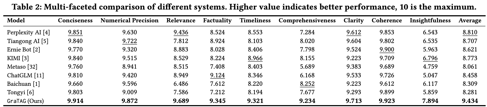

# GraTAG — Production AI Search via Graph-Based Query Decomposition and Triplet-Aligned Generation with Rich Multimodal Representations

<p align="center">
  
</p>

**GraTAG** is a full-stack AI search framework designed to improve **relevance**, **comprehensiveness**, and **presentation** of answers. It combines:

* **GQD (Graph-Based Query Decomposition)** — decomposes complex/ambiguous queries into structured sub-queries with explicit dependencies for precise, stepwise retrieval. 

<p align="center">
  
</p>

* **TAG (Triplet-Aligned Generation)** — constructs relation triplets from retrieved documents to model entity relations, factual dependencies, and logical links, improving coherence and coverage. 

<p align="center">
  
</p>

* **Rich Multimodal Presentations** — timeline visualization and textual-visual choreography to reduce cognitive load and aid verification. 

<p align="center">
  
</p>

Extensive evaluations on recent real-world queries report that GraTAG **outperforms eight existing systems** in human expert assessments, excelling in relevance, comprehensiveness, and insightfulness. 
<p align="center">
  
</p>

---

## Repository Layout (as provided)

```
.
├── alg/
│   ├── src/
│   │   ├── include/
│   │   ├── model_training/
│   │   │   ├── GQD/                 # GQD-related training code
│   │   │   └── TAG/                 # TAG-related training code  (subfiles omitted)
│   │   ├── modules/
│   │   ├── pipeline/
│   │   └── script/
│   ├── Dockerfile
│   ├── LICENSE
│   ├── requirements.txt
│   ├── route.json
│   ├── run.py
│   └── README.md
├── backend/                         # Backend application code
├── frontend/                        # Frontend application code
└── README.md                        # (this file)
```

> Notes: `frontend/` stores the web UI; `backend/` stores backend code; `alg/` contains algorithm services and training. The full GraTAG pipeline integrates GQD, TAG, and multimodal presentation components. 

---
## Concepts at a Glance
* **GQD** represents decomposed sub-queries as a directed structure to capture sequential or parallel dependencies and guide retrieval flow. 
* **TAG** aligns answer generation with extracted triplets so cross-chunk logic is preserved, boosting coherence and factuality. 
* **Multimodal Presentation** includes timeline visualizations and paragraph-image choreography to enhance readability and verification. 

A high-level pipeline (query preprocessing → GQD → retrieval → chunk selection/rerank → TAG → multimodal outputs) is illustrated and described in the paper.

---

## Code Documentation

Due to the extensive codebase and complexity of the implementation, a detailed **Cookbook** with step-by-step explanations, usage examples, and implementation guides will be released in the near future.