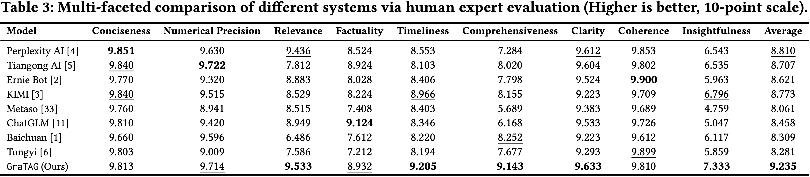

# GraTAG: Production AI Search via Graph-Based Query Decomposition and Triplet-Aligned Generation with Rich Multimodal Representations

<p align="center">
  <a href="https://creativecommons.org/licenses/by-nc/4.0/"></a>
  
</p>

<p align="center">
  
</p>

**GraTAG** is an end-to-end production-ready AI search engine framework that addresses key challenges in relevance, comprehensiveness, and presentation through three core innovations:

* **Graph-Based Query Decomposition (GQD)** — decomposes complex queries into atomic sub-queries represented as a directed acyclic graph (DAG), capturing parallel and joint dependencies for finer-grained reasoning. The GQD model is post-trained via SFT followed by GRPO alignment with RAG task performance.

* **Triplet-Aligned Generation (TAG)** — extracts relation triplets from retrieved documents and aligns them with the answer generation process to bridge missing logic across chunks, enhancing coherence and mitigating hallucination. TAG employs a cold-start triplet extraction stage followed by REINFORCE-based triplet alignment.

* **Rich Multimodal Presentations** — integrates timeline visualization and textual-visual choreography (image-text matching via Hungarian algorithm) to reduce cognitive load and enhance information verification.

Evaluated on 1,000 recent real-world queries with over 243,000 expert ratings across 9 criteria, GraTAG **outperforms eight existing systems** in human expert assessments. Compared to the strongest baseline, GraTAG improves comprehensiveness by **10.8%**, insightfulness by **7.9%**, and the overall average score by **4.8%**. On the public benchmark BrowseComp, GraTAG outperforms the best baseline by **17.3%**.

<p align="center">
  
</p>

---

## Table of Contents

- [Architecture Overview](#architecture-overview)
- [Infrastructure Dependencies](#infrastructure-dependencies)
- [Deployment Guide](#deployment-guide)
- [Model Training](#model-training)
- [Documentation](#documentation)
- [License](#license)
- [Disclaimer](#disclaimer)

---

## Architecture Overview

GraTAG adopts a three-tier architecture. The services communicate via HTTP: **Frontend → Backend API → Algorithm Service**.

| Directory | Description |
|-----------|-------------|
| `alg/` | Algorithm service — core AI pipeline implementing GQD, TAG, multi-source retrieval, and multimodal presentation (Flask + NetworkX + Transformers) |
| `backend/` | Backend service — RESTful API layer handling user management, QA session persistence, and algorithm service orchestration (Flask + MongoEngine + JWT) |
| `frontend/` | Frontend application — search interface with streaming answer display, timeline visualization, and document preview (Nuxt 3 + TypeScript + SCSS) |
| `experiments/` | Evaluation benchmarks (SearchBench-1000, BrowseComp) and baseline answer collection via browser automation (Playwright + GPT-4o) |
| `docs/` | Technical documentation — module reference, API reference, and configuration guide |
| `assets/` | Static resources — images and figures used in documentation |

The algorithm service exposes two endpoints (`/execute` and `/stream_execute`) for synchronous and streaming invocations respectively. Key sub-directories under `alg/src/` include `pipeline/` (orchestration), `modules/` (GQD, TAG, retrieval, timeline), `model_training/` (GQD and TAG training scripts), and `include/` (shared config and context management).

## Infrastructure Dependencies

| Service | Purpose | Version |
|---------|---------|---------|
| **MongoDB** | Application data storage (QA sessions, users, subscriptions) | 4.x+ |
| **Elasticsearch** | Context persistence, search indexing, and full-text retrieval | 7.10+ |
| **Milvus** | Vector similarity search for dense retrieval | 2.4+ |
| **LLM Inference** | Language model serving (vLLM / HuggingFace TGI compatible) | — |
| **Nacos** | Service discovery and registration (optional) | 1.x |
| **OSS / MinIO** | Object storage for documents and images | — |

---

## Deployment Guide

### Prerequisites: Infrastructure Services

Before deploying GraTAG, ensure the following infrastructure services are running and accessible:

| Service | Required | Default Port | Setup |
|---------|----------|-------------|-------|
| MongoDB | Yes | 27017 | Stores user data, QA sessions, subscriptions. Create a database (e.g. `gratag`) with authentication. |
| Elasticsearch | Yes | 9200 | Stores QA context for multi-turn conversations and provides full-text retrieval. Version 7.10+ recommended. |
| Milvus | Optional | 19530 | Provides dense vector retrieval. Required for vector similarity search in the recall stage. Version 2.4+ recommended. |
| LLM Inference | Yes | — | vLLM or HuggingFace TGI compatible endpoint serving models such as Qwen2.5-72B-Instruct. |
| OSS / MinIO | Optional | 9000 (MinIO) | Object storage for uploaded documents and images. Required for document QA mode. |
| Nacos | Optional | 8848 | Service discovery and centralized configuration management. Can be replaced by local config files. |

---

### Step 1: Deploy Algorithm Service

**1.1 Environment Setup**

```bash
cd alg/src

conda create -n gratag python=3.9 -y
conda activate gratag

pip install -r requirements.txt

# Chinese NLP model (required for spaCy tokenization)
pip install zh_core_web_sm-3.8.0.tar.gz
```

**1.2 Configuration**

Edit `include/config/common_config.py` with your infrastructure endpoints:

```python
CommonConfig = {
    # LLM inference endpoints
    "FSCHAT": {
        "vllm_url": "http://<llm-host>:8000/v1",
        "hf_url":   "http://<llm-host>:8001"
    },

    # Elasticsearch (QA context storage)
    "ES_QA": {
        "url":   "http://<es-host>:9200",
        "index": "gratag_qa_context",
        "auth":  "<username>",
        "passwd": "<password>"
    },

    # MongoDB
    "MONGODB": {
        "Host": "<mongodb-host>",
        "Port": 27017,
        "DB":   "gratag",
        "Username": "<username>",
        "Password": "<password>",
        "authDB":   "admin"
    },

    # Milvus (vector search, optional)
    "MILVUS": {
        "host": "<milvus-host>",
        "port": 19530,
        "collection": "gratag_vectors"
    },

    # Reranking thresholds
    "RERANK": {
        "topk_es":     1000,
        "topk_vec":    500,
        "topk_rerank": 150
    },

    # External search API
    "IAAR_DataBase": {
        "url": "http://<search-api-host>/search"
    }
}
```

Also configure `include/config/query_recommend_config.py` for query recommendation settings.

**1.3 Launch**

```bash
# Development
python run.py --host 0.0.0.0 --port 10051

# Production (with gunicorn)
gunicorn -w 4 -b 0.0.0.0:10051 --timeout 300 run:app
```

**1.4 Docker Deployment**

```bash
cd alg/src
docker build -t gratag-alg .
docker run -d \
  --name gratag-alg \
  -p 10051:10051 \
  gratag-alg
```

The algorithm Dockerfile (`alg/src/Dockerfile`) is based on the `iaar/ainews:v4.1` image with Python 3.9, and automatically installs dependencies and the Chinese spaCy model. The exposed port range is `10000–20000`.

**1.5 Verify**

```bash
curl -X POST http://localhost:10051/execute \
  -H "Content-Type: application/json" \
  -d '{"function": "recommend_query", "body": {"query": "test"}}'
```

---

### Step 2: Deploy Backend Service

**2.1 Environment Setup**

```bash
cd backend

pip install -r requirements.txt
```

**2.2 Configuration**

The backend supports two configuration modes: **local config file** or **Nacos centralized config**.

**Option A: Local Configuration**

Copy `Backend/config/config.ini` to `Backend/config/config_local.ini` and fill in all fields:

```ini
[DEFAULT]
Host = 0.0.0.0
Port = 5000
LOG_DIR = ./logs
TOKEN_KEY = <your-jwt-secret-key>
ALGORITHM_URL = http://<alg-host>:10051

[MONGO]
Host = <mongodb-host>
Port = 27017
DB = gratag
Username = <username>
Password = <password>
authDB = admin

[ES]
url = http://<es-host>:9200
auth = <username>
passwd = <password>
search_index = gratag_search

[PROMETHEUS]
enable_flask = True
process_name = gratag-backend

[MINIO]
url = http://<minio-host>:9000
access_key = <access-key>
secret_key = <secret-key>

[OSS]
endpoint = <oss-endpoint>
access_key_id = <access-key-id>
access_key_secret = <access-key-secret>
bucket_name = <bucket-name>
img_bucket = 
oss_env = prod
```

Then set Nacos to use local mode in `Backend/config/nacos_config.ini`:

```ini
[NACOS]
REGISTRATION_SWITCH = false
LOCAL_CONFIG = true
```

**Option B: Nacos Centralized Configuration**

Edit `Backend/config/nacos_config.ini`:

```ini
[NACOS]
REGISTRATION_SWITCH = true
LOCAL_CONFIG = false
SERVER_ADDRESSES = <nacos-host>:8848
NAMESPACE = <namespace-id>
AK = <access-key>
SK = <secret-key>
DATA_ID = gratag-backend-config
GROUP = DEFAULT_GROUP
LOG_DIR = ./logs
SERVICE_NAME = gratag-backend
CLUSTER_NAME = DEFAULT
```

Push the configuration JSON to Nacos with the same structure as `config.ini` sections (keys: `default`, `mongo`, `ES`, `PROMETHEUS`, `MINIO`, `OSS`, etc.).

**2.3 Launch**

```bash
cd Backend

# Development
python run.py

# Production (with gunicorn)
gunicorn -w 4 -b 0.0.0.0:5000 --timeout 300 "app:app"
```

When Nacos registration is enabled, the backend automatically registers itself and sends heartbeats every 3 seconds. The environment variable `NACOS_HOST_IP` must be set to the host's accessible IP.

**2.4 Docker Deployment**

**Using python:3.9-slim base image (recommended for fresh builds):**

```bash
cd backend
docker build -f Dockerfile1 -t gratag-backend .
docker run -d \
  --name gratag-backend \
  -p 5000:5000 \
  -e NACOS_HOST_IP=<host-ip> \
  -v $(pwd)/Backend/logs:/app/Backend/logs \
  gratag-backend \
  python run.py
```

This Dockerfile installs Java Runtime, LibreOffice (for document conversion), and additional dependencies including Azure Cognitive Services and MinIO client.

**Using pre-built base image:**

```bash
cd backend
docker build -t gratag-backend .
docker run -d \
  --name gratag-backend \
  -p 5000:5000 \
  -e NACOS_HOST_IP=<host-ip> \
  gratag-backend \
  python run.py
```

**2.5 Verify**

```bash
# Health check
curl http://localhost:5000/api/heartbeat
# Expected: {"status": "1"}
```

**2.6 Key Backend Features**

- **JWT Authentication**: 30-day access token expiry, blacklist-enabled, login status validation with 7-day rolling expiry.
- **CORS**: Fully open (`*`) for cross-origin requests.
- **Prometheus Monitoring**: Enabled via config, exposes `/metrics` endpoint.
- **Request Logging**: All requests/responses logged to `logs/response.log` with user identity, timing, and full payloads.
- **Admin Access Control**: `/admin/*` routes require `access_type != 'normal'`.

---

### Step 3: Deploy Frontend

**3.1 Environment Setup**

```bash
cd frontend

# Uses pnpm-compatible .npmrc; npm/pnpm both work
npm install
```

**3.2 Environment Configuration**

The frontend uses environment files to configure the backend API endpoint:

**Development** (`.env.dev`):

```
VITE_API=https://<dev-api-gateway>/back/
VITE_ENV=sit
```

**Production** (`.env.prod`):

```
VITE_API=https://<prod-api-gateway>/back/
VITE_ENV=prod
```

**3.3 Launch**

```bash
# Development (with hot-reload)
npm run dev

# Production build
npm run build

# Production server (Nuxt 3 SSR)
npm run start
```

**3.4 Docker Deployment**

The project includes a `.dockerignore` for the frontend. A typical Dockerfile for the Nuxt 3 frontend:

```dockerfile
FROM node:18-alpine
WORKDIR /app
COPY package*.json ./
RUN npm install
COPY . .
RUN npm run build
EXPOSE 3000
CMD ["node", ".output/server/index.mjs"]
```

```bash
cd frontend
docker build -t gratag-frontend .
docker run -d \
  --name gratag-frontend \
  -p 3000:3000 \
  gratag-frontend
```

**3.5 Reverse Proxy (Nginx Example)**

In production, use a reverse proxy to unify frontend and backend under one domain:

```nginx
server {
    listen 80;
    server_name your-domain.com;

    location / {
        proxy_pass http://localhost:3000;
        proxy_http_version 1.1;
        proxy_set_header Upgrade $http_upgrade;
        proxy_set_header Connection "upgrade";
    }

    location /api/ {
        proxy_pass http://localhost:5000/api/;
        proxy_http_version 1.1;
        proxy_set_header X-Real-IP $remote_addr;
        proxy_set_header X-Forwarded-For $proxy_add_x_forwarded_for;

        # SSE streaming support
        proxy_set_header Connection '';
        proxy_buffering off;
        proxy_cache off;
        chunked_transfer_encoding on;
        proxy_read_timeout 300s;
    }
}
```

---

### Startup Order

1. Infrastructure services (MongoDB, Elasticsearch, Milvus, LLM)
2. Algorithm service (`alg/src/run.py`)
3. Backend service (`backend/Backend/run.py`)
4. Frontend (`frontend/`)

### Environment Variables

| Variable | Service | Description |
|----------|---------|-------------|
| `NACOS_HOST_IP` | Backend | Host IP for Nacos service registration |
| `VITE_API` | Frontend | Backend API gateway URL |
| `VITE_ENV` | Frontend | Environment identifier (`sit` / `prod`) |

### Test-Time Latency

GraTAG maximizes parallelism (e.g., executing lateral sub-queries in GQD concurrently) and employs model fine-tuning and quantization to reduce latency.

| System | Latency (s) |
|--------|-------------|
| GraTAG | 14.2 |
| Perplexity AI | 13.9 |
| Tiangong AI | 4.0 |
| Ernie Bot | 6.0 |
| KIMI | 2.8 |
| Metaso | 10.4 |
| ChatGLM | 7.9 |
| Baichuan | 6.1 |
| Tongyi | 10.4 |

GraTAG latency is measured on a cluster of **16 Muxi MXC500 GPUs** (each ~70% computing power of NVIDIA A800). Baselines are measured via their publicly available interfaces.

---

## Model Training

### GQD Training

GQD adopts a two-stage training procedure: supervised fine-tuning (SFT) followed by Group Relative Policy Optimization (GRPO).

**Prerequisites:**

```bash
cd alg/src/model_training/GQD
pip install -r requirements.txt
```

**Stage 1 — Supervised Fine-Tuning:**

Training data format (JSONL):

```json
{"query": "user query", "decomposition": "{'is_complex': True, 'sub_queries': [...], 'parent_child': [...]}"}
```

```bash
python GQD_Stage_1_SFT.py \
    --model_path Qwen/Qwen2.5-72B-Instruct \
    --dataset_path ./data/sft_data.jsonl \
    --output_dir ./outputs/stage1 \
    --model_type qwen \
    --lr 5e-5 \
    --use_lora
```

| Hyperparameter | Value |
|----------------|-------|
| Base Model | Qwen2.5-72B-Instruct |
| Learning Rate | 5e-5 |
| Batch Size | 2–4 |
| Gradient Accumulation | 4–8 |
| Epochs | 3 |
| Max Sequence Length | 2048 |
| LoRA r / alpha | 16 / 32 |

**Stage 2 — GRPO Alignment:**

Training data format (JSONL):

```json
{"query": "user query", "answer": "reference answer"}
```

```bash
python GQD_Stage_2_GRPO.py \
    --model_path ./outputs/stage1/final_model \
    --dataset_path ./data/grpo_data.jsonl \
    --output_dir ./outputs/stage2 \
    --lr 5e-7 \
    --K_samples 8
```

| Hyperparameter | Value |
|----------------|-------|
| Learning Rate | 5e-7 |
| K (sampled GQDs per query) | 8 |
| C (independent retrievals per GQD) | multiple |
| Beta KL (β) | 0.01 |
| Epsilon Clip (ε) | 0.2 |
| Temperature | 0.7 |
| Top-p | 0.9 |
| Evidence Cache Similarity | 0.95 |

**One-click Training:**

```bash
bash quick_start.sh
```

### TAG Training

TAG employs a two-stage approach: (1) triplet extraction cold start via SFT, and (2) answer generation training with REINFORCE-based triplet alignment.

**Stage 1 — Triplet Extraction Cold Start:**

A strong teacher model (GPT-4o) first extracts high-quality relation triplets for each (sub-query, chunks) pair. The triplets encapsulate entity details, inter-entity relations, and implicit factual/logical dependencies. After manual quality verification, the target LLM is fine-tuned via SFT to produce concise triplets, using dedicated extraction tokens `⟨startextraction⟩` and `⟨endextraction⟩`.

```bash
python TAG_Stage_1_train_lora_all_lr5e-5.py \
    --warmup \
    --model_path <qwen2.5-72b-instruct-path>
```

| Hyperparameter | Value |
|----------------|-------|
| Base Model | Qwen2.5-72B-Instruct |
| Teacher Model | GPT-4o |
| Learning Rate | 5e-5 |
| Batch Size | 1 |

**Stage 2 — Answer Generation Training and Triplet Alignment:**

The model learns to generate answers with and without triplet augmentation. A three-layer MLP with ReLU computes per-token weights ω from concatenated hidden states. The REINFORCE algorithm selects the most beneficial triplet for each sample, with a length-aware bonus encouraging concise triplets. The total loss is:

`L = L_ans + α · L_REINFORCE`

```bash
python TAG_Stage_2_train.py \
    --model_path <stage1-model-path> \
    --lr 5e-7 \
    --n_passes 3 \
    --n_ahead 200 \
    --original_loss_weight 0.5
```

| Hyperparameter | Value |
|----------------|-------|
| Learning Rate | 5e-7 |
| α (REINFORCE weight) | 0.5 |
| γ (length-aware bonus) | > 0 |
| MLP layers | 3 (ReLU) |
| N Passes | 3 |
| N Ahead (lookahead tokens) | 200 |

**Evaluation:**

```bash
python pipeline_evaluation_new_exp.py
```

---

## Documentation

For detailed technical references, see the `docs/` directory:

| Document | Description |
|----------|-------------|
| [Module Reference](docs/module_reference.md) | Core pipeline modules — GQD, TAG, retrieval, timeline, context management |
| [API Reference](docs/api_reference.md) | Backend REST endpoints, streaming protocol, search modes, data models |
| [Configuration](docs/configuration.md) | Algorithm service and backend configuration parameters |

---

## License

This project is licensed under the [Creative Commons Attribution-NonCommercial 4.0 International License (CC BY-NC 4.0)](https://creativecommons.org/licenses/by-nc/4.0/).

You are free to:

* **Share** — copy and redistribute the material in any medium or format
* **Adapt** — remix, transform, and build upon the material

Under the following terms:

* **Attribution** — You must give appropriate credit, provide a link to the license, and indicate if changes were made.
* **NonCommercial** — You may not use the material for commercial purposes.

For commercial licensing inquiries, please contact the authors.

## Disclaimer

This software is provided for **academic and research purposes only**. The authors make no warranties regarding the accuracy, completeness, or reliability of the software. Use of this software in any commercial product or service is strictly prohibited without prior written consent from the authors.

The evaluation benchmarks (SearchBench-1000, BrowseComp) and baseline results included in this repository are intended solely for research reproducibility. Any use of crawled data must comply with the respective platforms' terms of service.